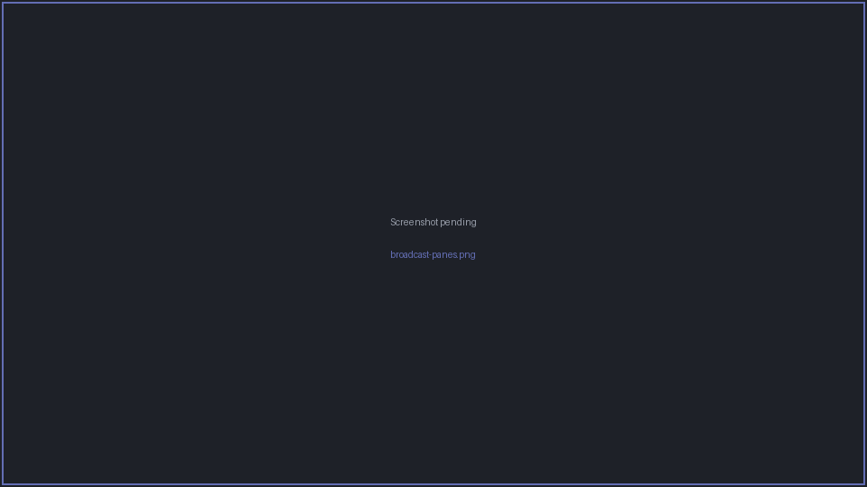

# Broadcast input

**Broadcast** lets you type once and send the same keystrokes to **several panes at the same
time** — ideal for running the same command across many hosts in parallel.

## Turning it on

Toggle broadcast with **Preferences → Toggle Broadcast** or ++ctrl+shift+b++.

While broadcast is on, what you type in the focused pane is mirrored to the other participating
panes in the same tab.

## Opting panes out

Each pane has a **checkbox** to opt out of broadcast. Uncheck a pane to leave it untouched while
still broadcasting to the rest — useful when one pane is a different host or you want to keep one
session read-only.

!!! tip "Macros broadcast too"
    Running a [macro](macros.md) on the active pane respects broadcast: with broadcast on, the
    macro's keystrokes fan out to all participating panes.

!!! warning "Double-check before destructive commands"
    Broadcast sends your input to every participating pane. Confirm which panes are opted in
    before running anything destructive (`rm`, service restarts, etc.).
