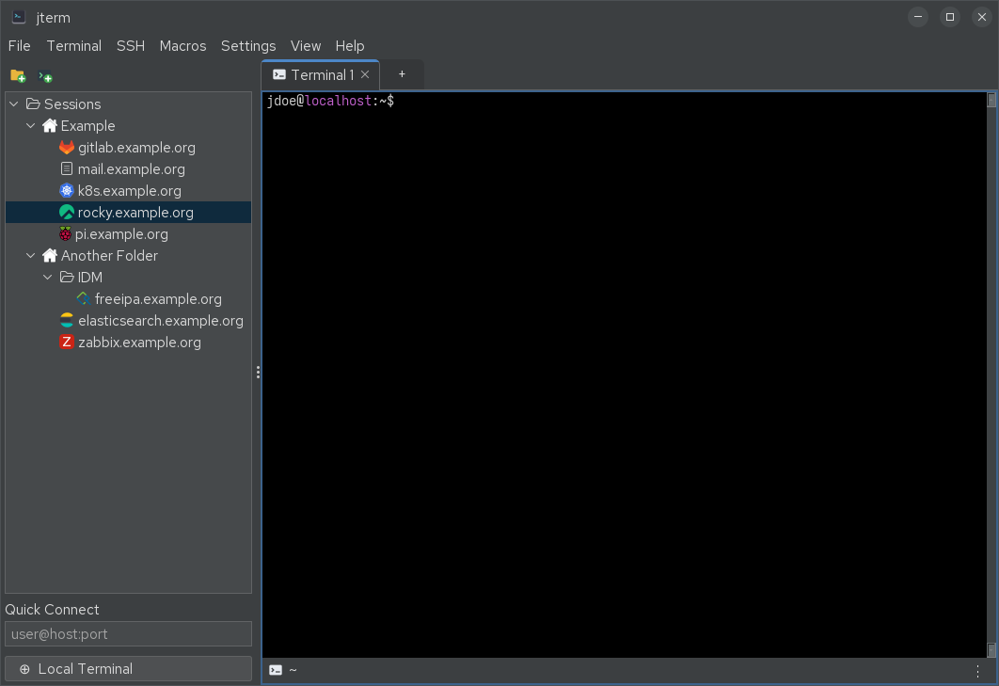

# Getting started

## Installing

The easiest way to run jterm is a pre-built binary from the
[GitHub Releases](https://github.com/drecaise/jterm/releases) page:

| Platform | Asset | Install / run |
|----------|-------|---------------|
| Windows | `jterm-<version>.msi` | Run the installer |
| macOS | `jterm-<version>.dmg` | Open the disk image, drag jterm to Applications |
| Linux | `jterm-<version>.flatpak` | `flatpak install jterm-<version>.flatpak` |
| Linux (RHEL family) | `jterm-<version>.x86_64.rpm` | `sudo dnf install ./jterm-<version>.x86_64.rpm` |
| Linux | `jterm-<version>.snap` | `sudo snap install --classic --dangerous jterm-<version>.snap` |
| Any OS | `jterm-<version>.jar` | `java -jar jterm-<version>.jar` (needs a JRE 21) |

Everything except the bare `.jar` bundles its own Java runtime, so you don't need a separate
JDK/JRE. The RPM is built on **Rocky Linux 10**, so it's the right pick for Rocky/RHEL/Alma
10 and friends; on other distros prefer the Flatpak.

!!! warning "macOS first launch"
    The macOS `.dmg` is currently **unsigned**, so Gatekeeper blocks the first launch.
    Right-click the app and choose *Open* to run it the first time.

If you prefer to build from source, see the [README](https://github.com/drecaise/jterm#building).

## First launch

When jterm starts it opens a window with:

- a **menu bar** — *File, Terminal, SSH, Macros, Settings, View, Help*;
- a **sessions sidebar** on the left — your saved SSH sessions and folders, plus an
  **Open Local Terminal** entry;
- a **tab strip** with a **+** button to add tabs; and
- the **terminal area**, where each tab holds one or more panes.

By default jterm opens a local shell on startup. You can turn that off in
**Settings → General → Open a terminal on startup** (see [Settings](settings.md)).

## Opening your first terminal

- **Local shell:** click **Open Local Terminal** in the sidebar, press ++ctrl+shift+t++, or use
  **Terminal → Open Local Shell**. This launches your default login shell in a real PTY.
- **SSH session:** double-click a saved session in the sidebar, or drag it onto a pane. If you
  have no saved sessions yet, see [SSH sessions](ssh-sessions.md) to create one.

## Next steps

- Lay out your workspace with [Tabs & panes](tabs-and-panes.md).
- Organise connections in the [Sessions sidebar](sessions-sidebar.md).
- Learn the [Keyboard shortcuts](shortcuts.md).
