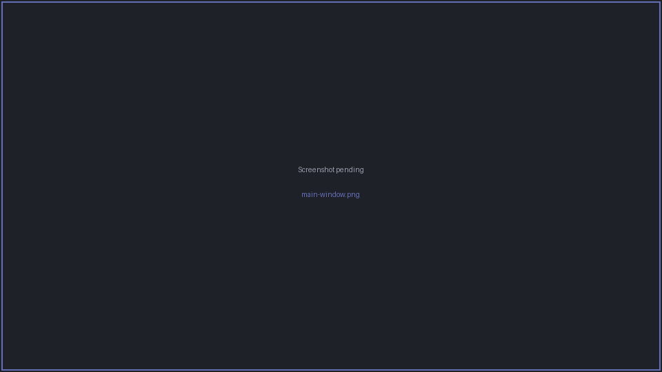

# jterm User Manual

**jterm** is a cross-platform desktop **terminal emulator** built in Java 21. It gives you
tabbed windows, a uniform splittable pane grid, a saved-sessions sidebar for organising SSH
connections, drag-and-drop session launching, input broadcast, an SFTP file browser, SSH port
forwarding, and light/dark theming that follows your operating system.

## What you can do

- Open **local shells** and **SSH sessions** side by side.
- Split any tab into a uniform grid of up to **3 columns × 3 rows** (9 panes).
- Save SSH connections in a **sidebar** of folders, each with its own icon.
- **Drag** a session onto a pane to open it in a split.
- Authenticate over SSH with **ssh-agent**, **on-disk keys**, or **passwords** stored in an
  encrypted vault.
- Hop through **jump hosts (bastions)**, browse remote files over **SFTP**, and set up
  **port-forwarding tunnels**.
- **Broadcast** your typing to several panes at once.
- Replay **macros** of canned keystrokes.

## Where to start

- New to jterm? Read **[Getting started](getting-started.md)**.
- Want to connect to a server? See **[SSH sessions](ssh-sessions.md)** and
  **[SSH auth & vault](ssh-auth-and-vault.md)**.
- Power-user layout: **[Tabs & panes](tabs-and-panes.md)** and
  **[Keyboard shortcuts](shortcuts.md)**.
- Something not working? Try **[Troubleshooting](troubleshooting.md)**.

!!! note "This manual vs. the README"
    The project [README](https://github.com/drecaise/jterm#readme) is the quick reference for
    building and installing. This manual is the task-oriented guide to *using* the application.
