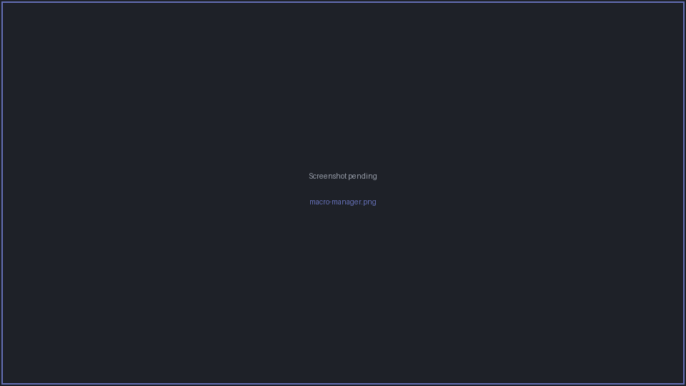
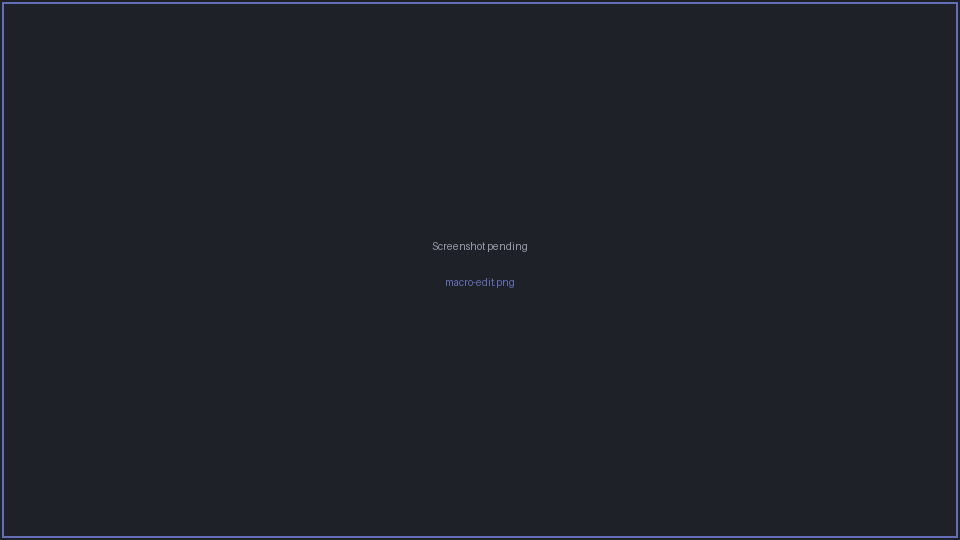

# Macros

A **macro** is a saved sequence of keystrokes you can replay into a terminal — for example a
canned login banner dismissal, a series of menu selections, or a frequently typed command.

## Running a macro

Saved macros appear in the **Macros** menu — selecting one replays it into the **active pane**.
A macro can also have a **hotkey** bound to it for one-press execution. With
[broadcast](broadcast.md) on, a macro's keystrokes fan out to all participating panes.

## Managing macros

Open **Macros → Manage Macros…** to see your macro library. From there you can create
(**New…**), **Edit…**, or **Delete** macros.

## Editing a macro

The macro editor has a **Name**, an optional **Hotkey**, and an ordered list of **steps**. Build
the sequence with **Edit / Insert above / Insert below / Delete** (and **Clear** to start over).

Each step is one of:

| Step | What it sends |
|------|---------------|
| **Text** | Literal text. Optionally type it character-by-character with a per-keystroke delay (in ms) to mimic real typing. |
| **Key** | A single special key (Enter, Tab, arrows, Ctrl-combinations, etc.). |
| **Sleep** | A pause (in ms) before the next step. |

!!! note "Macros are built, not recorded"
    You assemble a macro from explicit steps rather than recording live input. There is no
    "wait for output pattern" step — use a **Sleep** step to pace the sequence instead.
