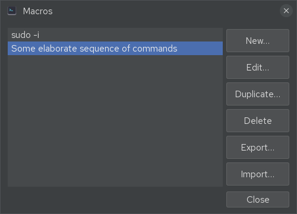
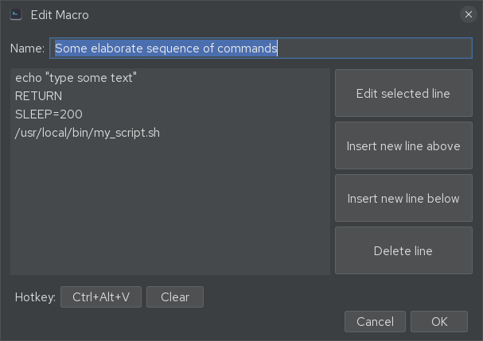

# Macros

A **macro** is a saved sequence of keystrokes you can replay into a terminal — for example a
canned login banner dismissal, a series of menu selections, or a frequently typed command.

## Running a macro

Saved macros appear in the **Macros** menu — selecting one replays it into the **active pane**.
A macro can also have a **hotkey** bound to it for one-press execution. With
[broadcast](broadcast.md) on, a macro's keystrokes fan out to all participating panes.

## Managing macros

Open **Macros → Manage Macros…** to see your macro library. From there you can create
(**New…**), **Edit…**, **Duplicate…**, or **Delete** macros, and **Export…** / **Import…** them.
The list is multi-select, so you can pick several at once.

**Duplicate…** opens the editor on a copy of the selected macro, named `<name> (1)`. The copy
carries every step but **not** the hotkey — two macros on one combination would mean only one of
them ever fires, so you assign a new one yourself. Nothing is added to the library until you press
OK, so cancelling the editor throws the copy away.

## Editing a macro

The macro editor has a **Name**, an optional **Hotkey**, and an ordered list of **steps**. Build
the sequence with **Edit / Insert above / Insert below / Delete**.

Each step is one of:

| Step | What it sends |
|------|---------------|
| **Text** | Literal text. Optionally type it character-by-character with a per-keystroke delay (in ms) to mimic real typing. |
| **Key** | A single special key (Enter, Tab, arrows, Ctrl-combinations, etc.). |
| **Sleep** | A pause (in ms) before the next step. |

!!! note "Macros are built, not recorded"
    You assemble a macro from explicit steps rather than recording live input. There is no
    "wait for output pattern" step — use a **Sleep** step to pace the sequence instead.

## Exporting and importing

**Macros → Manage Macros… → Export…** writes the selected macros to a JSON file (or all of them
when nothing is selected); **File → Export Macros…** always writes the whole library. The save
dialog offers **Protect this file with a passphrase**, which is **on by default** — the file is
then encrypted with AES-256-GCM under a passphrase you choose, independent of your master
password so the file still opens on another machine. Either way the file is written owner-only.

**Import…** reads a file back, asking for the passphrase if it needs one.

Imported macros **keep their ids**, so a macro that a session runs on connect keeps working when
you move a sessions export and a macros export together. If an id already exists you are asked
whether to **replace** it, **keep both** (the imported copy gets a new id), or **skip** it, with
an option to apply the same answer to the rest. A hotkey that is already taken by a keyboard
shortcut or another macro is cleared on the imported macro, and the import summary says which.

!!! warning "An imported macro is someone else's commands"
    A macro types straight into your shell, and can be bound to a hotkey or replayed
    automatically on connect. Only import files you trust, and review what you imported under
    **Manage Macros…** afterwards.

## Encrypting macros on disk

Macros live in `macros.json` in plain text by default. If you keep anything sensitive in one,
turn on **Settings → Preferences → General → Encrypt macros on disk**. Macro *contents* are then
encrypted with the same master password that protects your saved SSH passwords — there is no
second password to manage. Macro **names and hotkeys stay readable**, so the Macros menu and your
hotkeys keep working without unlocking anything; you are only asked for the master password when
a macro is actually run, edited or exported, and normally your OS keyring answers that silently.

!!! warning "What this does and does not protect"
    This protects `macros.json` **at rest** — in backups, synced folders, support bundles, on a
    lost disk, from other accounts on the machine. It does **not** protect against anything
    running as you: the master password normally comes back from the OS keyring without a prompt,
    so any program with your privileges can unlock the vault exactly as jterm does.

    It also does nothing about where a secret goes *after* the macro runs — it is still typed into
    the terminal in the clear, and can land in shell history, the scrollback, and the remote host's
    logs. **Prefer referencing a secret** (`ssh-agent`, `pass`, an environment variable) over
    pasting one into a macro.

!!! danger "Losing the master password loses the macros"
    Encrypted macros cannot be recovered without it, and jterm has no way to reset it. Export your
    macros first if you want a copy you can still read. Turning the setting back off restores
    `macros.json` to plain text with nothing lost.
