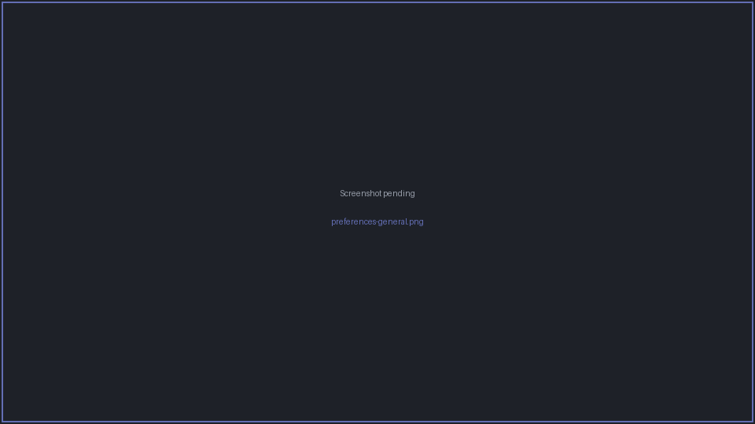
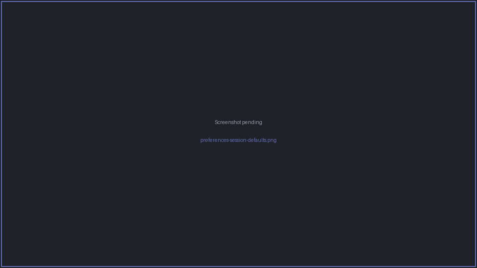

# Preferences

Open **Preferences → Preferences…** for the main settings dialog. It has four tabs. (The theme
toggle and the keyboard-shortcut editor live in the **Preferences** menu too — see
[Keyboard shortcuts](shortcuts.md).)

## General

| Setting | Effect |
|---------|--------|
| **Copy to clipboard on select** | Selecting text in the terminal copies it automatically. |
| **Paste on right click** | Right-click pastes. With this on, use ++ctrl++ + right-click for the context menu instead. |
| **Open a terminal on startup** | When off, jterm starts with no open tabs. |
| **Auto-accept new host keys** | Trust first-seen SSH hosts without prompting. You are still warned if a known host's key *changes*. |

## Session Defaults

Defaults inherited by folders and sessions that don't set their own (folders and individual
sessions can still override them):

- **Default username**
- **Default tab color**
- **Default key file** (blank uses your `~/.ssh` identities)
- **Default key passphrase** and **Default password** — stored **encrypted** in the credential
  vault (see [SSH auth & vault](ssh-auth-and-vault.md)); a blank field keeps any saved value.
- **Keep connection alive** + **interval (s)** — the root of the keep-alive inheritance chain.

Changes apply to **newly opened** sessions.

## Terminal Settings

The application-wide terminal defaults used by the local shell and by sessions that don't
override them:

- **Terminal type** (e.g. `xterm-256color`)
- **Character encoding** (default UTF-8)
- **Font family** and **font size**

These apply to **newly opened** terminals. Individual sessions can override them on their own
[Terminal Settings tab](ssh-sessions.md#terminal-settings).

## Highlighting

Define named **highlight lists** — rules that colour matching text as it appears in new output
(for example, flagging `ERROR` red or `WARN` yellow). Pick the **active list (global default)**
at the top; individual sessions can override which list they use. Highlighting applies to
**newly opened** terminals.

## Theme

Switch between **light** and **dark** with **Preferences → Toggle Light/Dark** (++ctrl+shift+l++).
On startup jterm follows your operating system's light/dark preference.

!!! note "Live recolour"
    Toggling the theme recolours the application chrome immediately. Already-open terminal panes
    keep the colours they were created with; new panes use the new theme.
