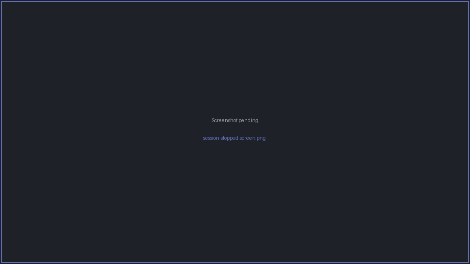

# Reconnect & save output

## When a session ends

When a session's process exits — an SSH connection drops, or a local shell finishes — the pane
doesn't just close. It shows a **session-stopped screen** with options to bring it back:

- **Reconnect** (**R**) — re-open the session, **keeping the existing scrollback** so you don't
  lose the history that was already on screen.
- **Restart** (**S**) — start a fresh session in the pane.
- Pressing ++enter++ also revives the pane.

For SSH sessions, reconnecting re-authenticates as usual (using the vault / agent where
possible — see [SSH auth & vault](ssh-auth-and-vault.md)). An [SFTP browser](sftp.md) that loses
its connection can reconnect automatically.

## Saving terminal output

You can write a pane's output to a file from the **pane title-bar menu** — useful for capturing
a session log. The menu on each pane's title bar exposes the save-output action.
