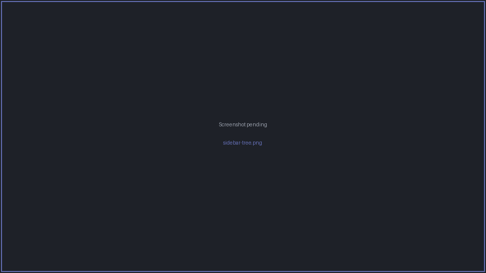
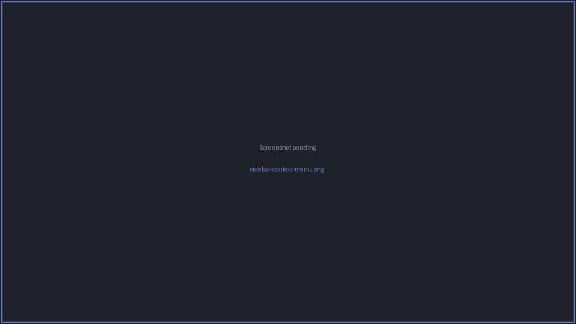
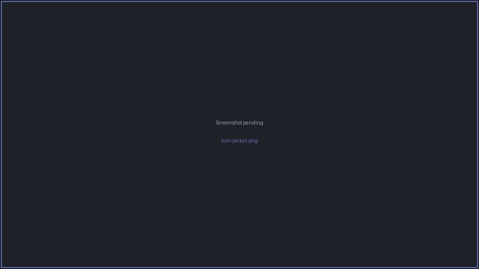

# Sessions sidebar

The sidebar on the left is where you keep your saved connections. It shows a tree of **folders**
and **SSH sessions** (each with its own icon), plus an **Open Local Terminal** entry at the top
for quick local shells.

## Opening a session

- **Double-click** a session to open it in the active pane (or a new tab if appropriate).
- **Drag** a session onto a pane to open it in a split — see
  [Tabs & panes](tabs-and-panes.md#drag-and-drop-to-split).
- **Right-click** a session for the full context menu (open in a new tab or split, edit,
  duplicate, delete, move, launch SFTP, …).

## Creating and editing sessions

Right-click in the sidebar (or use the context menu on a folder) to **add a new SSH session** or
**new folder**. Editing a session opens the session dialog described in
[SSH sessions](ssh-sessions.md).

Other per-item actions:

- **Duplicate** an SSH session — ++ctrl+shift+d++ (or right-click → Duplicate).
- **Move up / down** to reorder within a folder — ++ctrl+shift+up++ / ++ctrl+shift+down++.
- **Delete** to remove a session or folder.

## Folders

Folders group related sessions and can be nested. Folders also carry **inherited defaults** —
a default username, tab colour, key file, passphrase, password and keep-alive setting that
sessions beneath them use unless they set their own (the inheritance chain is
folder → global defaults → built-in defaults). Edit a folder to set these.

You can open an **entire folder** of sessions at once. jterm offers two layouts:

- **separate tabs** — one tab per session; or
- **a split grid** — the sessions tiled into one tab's pane grid.

## Icons

Every session and folder can carry an **icon**. The icon picker offers a built-in library of
SVG/PNG icons (servers, cloud, monitoring, infrastructure, …), and you can **import your own**
PNG/JPG/GIF/SVG — imported files are copied into jterm's config directory so they travel with
your settings.

## WSL distributions (Windows)

On Windows, jterm auto-detects installed **WSL2** distributions and lists them so you can open a
shell in a distribution directly.

## Import and export

Use **File → Export Sessions…** to write your whole session tree to a file, and
**File → Import Sessions…** to load one back — handy for backups or moving your sessions to
another machine. (Saved passwords live in the encrypted vault, not in the exported session
tree — see [SSH auth & vault](ssh-auth-and-vault.md).)
