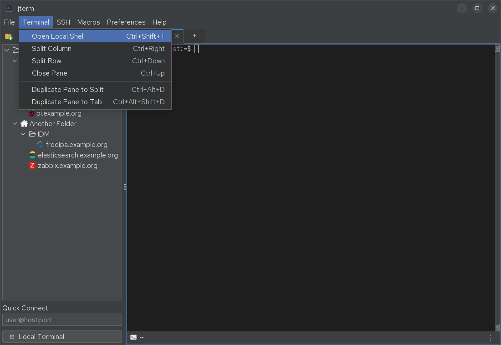
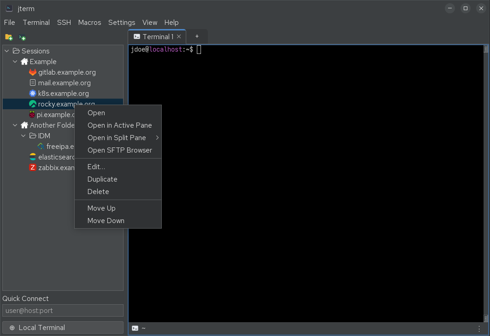
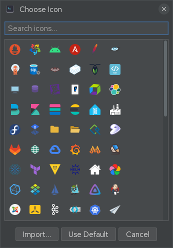

# Sessions sidebar

The sidebar on the left is where you keep your saved connections. It shows a tree of **folders**
and **SSH sessions** (each with its own icon), and underneath the tree a **Quick Connect** field
for one-off hosts plus a **Local Terminal** button for quick local shells.



## Showing and hiding

The sidebar can be closed to give the terminals the full window width. Three ways, all equivalent:

- **View → Sessions Sidebar** — the check mark tracks the current state.
- ++ctrl+shift+s++ — works even while a terminal has focus, and is rebindable under
  [Keyboard shortcuts](shortcuts.md).
- **Drag the divider** to the left edge of the window.

jterm remembers whether the sidebar was open and how wide it was, so it comes back the way you
left it on the next launch. While it is closed there is no divider to drag, so reopen it from the
menu or with the shortcut — pressing ++ctrl+shift+q++ (Quick Connect) also reopens it and puts the
caret in the field.

## Opening a session

- **Double-click** a session to open it in the active pane (or a new tab if appropriate).
- **Drag** a session onto a pane to open it in a split — see
  [Tabs & panes](tabs-and-panes.md#drag-and-drop-to-split).
- **Right-click** a session for the full context menu (open in a new tab or split, edit,
  duplicate, delete, move, launch SFTP, …).



## Quick Connect

Under the tree is a **Quick Connect** field for hosts you don't want to save. Type a target and
press ++enter++ — jterm opens the connection in a **new tab**.

```
[user@]host[:port]
```

The user name and port are optional:

- leaving the **user** off uses your global default username
  (**Preferences → Session Defaults**, which itself defaults to your OS user name);
- leaving the **port** off uses **22**.

So `db01.example.com`, `root@db01.example.com` and `root@db01.example.com:2222` are all valid.
An `ssh://` prefix is accepted (handy when pasting), and IPv6 literals work — use brackets if you
also need a port: `[2001:db8::1]:2222`. If the target can't be parsed, the field turns red and its
tooltip explains why; nothing is connected.

A quick connection is **not saved**:

- it never appears in the sidebar tree and nothing is written to `sessions.json`;
- it inherits your global defaults for key file, keep-alive and terminal settings, exactly as a
  saved session with those fields left blank would;
- authentication is ssh-agent → your default key → a password prompt if the server offers one.
  Because the connection has no saved identity to attach a secret to, the password prompt does
  **not** offer *Remember this password* (see [SSH auth & vault](ssh-auth-and-vault.md)).

Press ++ctrl+shift+q++ from anywhere to jump straight to the field. If you want to keep a host
around, create a saved [SSH session](ssh-sessions.md) for it instead.

!!! warning "Don't paste passwords here"
    `user:password@host` is rejected on purpose. Connect first and enter the password at the
    prompt, where it isn't shown on screen.

## Local Terminal

The **⊕ Local Terminal** button at the bottom opens a local shell in a **new tab** — it never
replaces whatever is running in the pane you're looking at. The one exception is when the focused
pane is **empty** (a cell you closed in a split, or a tab whose connection failed): then it fills
that empty pane instead of leaving it stranded. ++ctrl+shift+t++ does the same thing.

**Right-click** the button for the other placements:

- **Open in New Tab** — the same as clicking;
- **Open in Active Pane** — deliberately *replaces* the focused pane's session;
- **Open in Split Pane → Split Right / Split Below**.

You can also **drag** the button onto a pane to open a local shell in a split — see
[Tabs & panes](tabs-and-panes.md#drag-and-drop-to-split).

## Creating and editing sessions

Right-click in the sidebar (or use the context menu on a folder) to **add a new SSH session** or
**new folder**. Editing a session opens the session dialog described in
[SSH sessions](ssh-sessions.md).

Other per-item actions:

- **Duplicate** an SSH session — ++ctrl+shift+d++ (or right-click → Duplicate).
- **Move up / down** to reorder within a folder — ++ctrl+shift+up++ / ++ctrl+shift+down++.
- **Delete** to remove a session or folder.

## Folders

Folders group related sessions and can be nested. Folders also carry **inherited defaults** —
a default username, tab colour, key file, passphrase, password and keep-alive setting that
sessions beneath them use unless they set their own (the inheritance chain is
folder → global defaults → built-in defaults). Edit a folder to set these.

You can open an **entire folder** of sessions at once. jterm offers two layouts:

- **separate tabs** — one tab per session; or
- **a split grid** — the sessions tiled into one tab's pane grid.

## Icons

Every session and folder can carry an **icon**. The icon picker offers a built-in library of
SVG/PNG icons (servers, cloud, monitoring, infrastructure, …), and you can **import your own**
PNG/JPG/GIF/SVG — imported files are copied into jterm's config directory so they travel with
your settings.



## WSL distributions (Windows)

On Windows, jterm auto-detects installed **WSL2** distributions and lists them so you can open a
shell in a distribution directly.

## Import and export

Use **File → Export Sessions…** to write your whole session tree to a file, and
**File → Import Sessions…** to load one back — handy for backups or moving your sessions to
another machine. (Saved passwords live in the encrypted vault, not in the exported session
tree — see [SSH auth & vault](ssh-auth-and-vault.md).)
