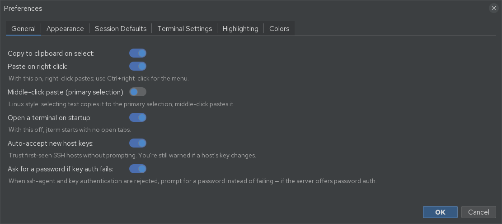
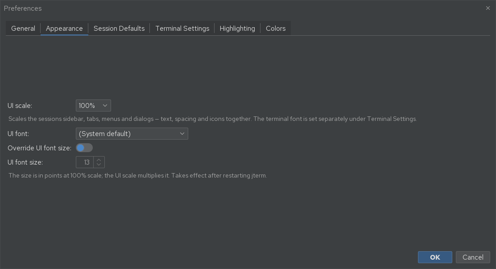
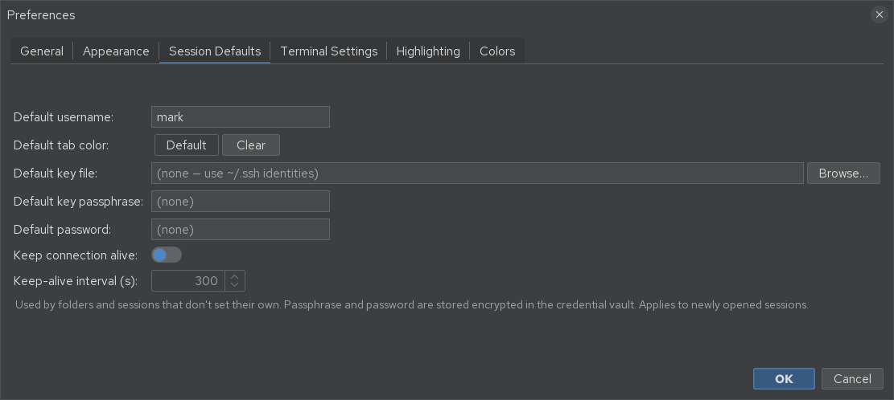
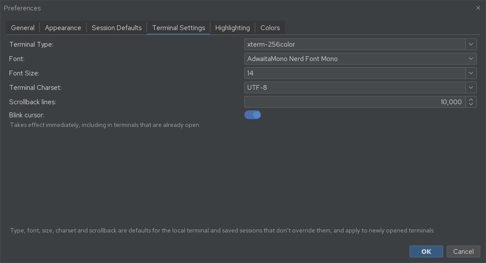
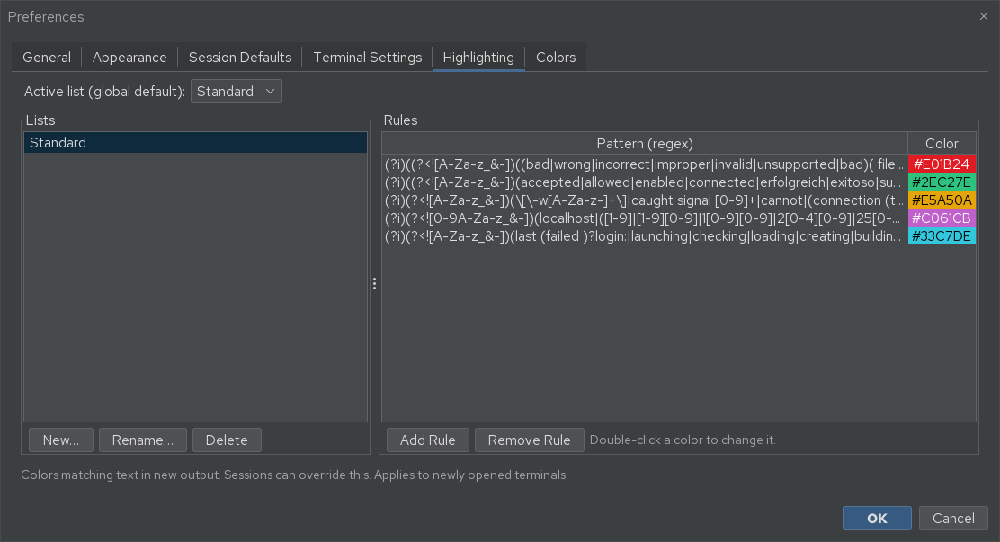
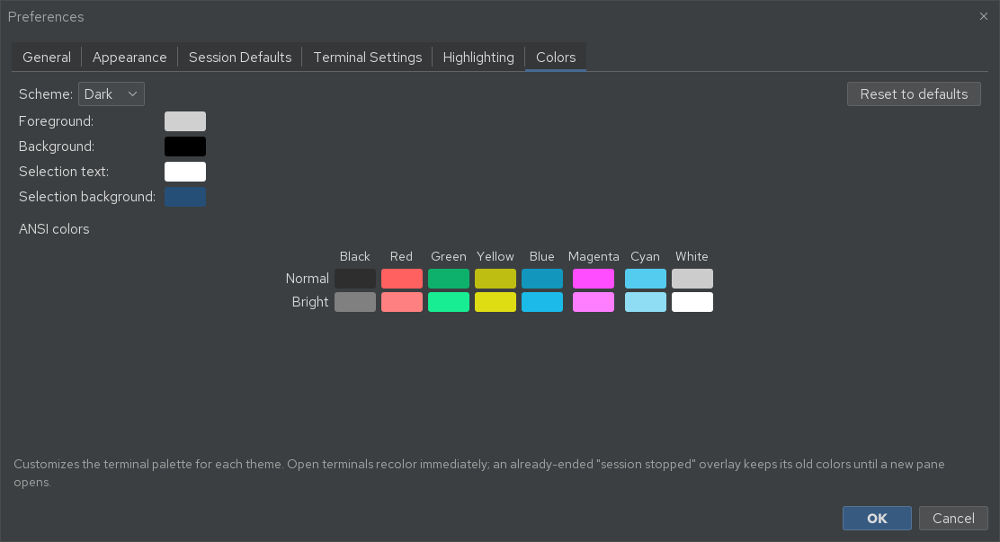

# Settings

Open **Settings → Preferences…** for the main settings dialog. It has six tabs. (The theme
toggle and the keyboard-shortcut editor live in the **Settings** menu too — see
[Keyboard shortcuts](shortcuts.md).)

## General

| Setting | Effect |
|---------|--------|
| **Copy to clipboard on select** | Selecting text in the terminal copies it automatically to the regular clipboard. |
| **Paste on right click** | Right-click pastes — always, even while a mouse-aware program is running (see the note below). With this on, use ++ctrl++ + right-click for the context menu, or ++shift++ + right-click to bypass the paste. |
| **Middle-click paste (primary selection)** | The Linux X11 convention: selecting text copies it to the *primary selection*, and a middle-click pastes it. Independent of, and separate from, the regular clipboard above. |
| **Open a terminal on startup** | When off, jterm starts with no open tabs. |
| **Show working directory** | Adds the shell's current directory to pane labels (full path) and its last part to tab titles. Local shells always show theirs in the pane label; this controls whether it reaches the tab. Over SSH and WSL it depends on the remote shell reporting it — see [Showing the working directory](tabs-and-panes.md#showing-the-working-directory). |
| **Auto-accept new host keys** | Trust first-seen SSH hosts without prompting. You are still warned if a known host's key *changes*. |
| **Ask for a password if key auth fails** | When ssh-agent and key authentication are rejected, prompt for a password instead of failing the connect — provided the server offers password authentication. On by default; see [SSH auth & vault](ssh-auth-and-vault.md#if-key-authentication-fails). |
| **Check for updates** | Ask GitHub about once a day whether a newer jterm release exists, and offer a link to it. On by default. Nothing about you or your sessions is sent — see [Update checks](#update-checks) below. |
| **Encrypt macros on disk** | Encrypt [macro](macros.md#encrypting-macros-on-disk) contents in `macros.json` with your master password. Off by default. Names and hotkeys stay readable, so the Macros menu and hotkeys work without unlocking. Protects backups and synced copies — **not** against programs running as you, and not against the secret reaching the terminal. |

!!! note "Right-click paste and mouse-aware programs"
    Some terminal programs (editors, `htop`, and CLIs such as coding assistants) turn on *xterm
    mouse reporting* so they can handle clicks themselves. When **Paste on right click** is on,
    jterm still pastes on a plain right-click in that case rather than forwarding the click — so
    the paste works consistently regardless of what's running. Hold ++shift++ while right-clicking
    to bypass the paste and fall through to the terminal's default handling.

!!! note "Middle-click paste on Windows and macOS"
    The primary selection is an X11 feature, so it only exists on Linux. On Windows and macOS
    there is no separate primary selection, so the toggle falls back to the **regular clipboard**:
    selecting text copies it to the clipboard and a middle-click pastes from the clipboard. The
    middle-button gesture still works — it just shares the one clipboard that ++ctrl+c++ /
    ++ctrl+v++ use, rather than a dedicated selection buffer.

### Update checks

With **Check for updates** on, jterm asks GitHub for the latest published release and, if it is
newer than the version you're running, shows a dialog with the release notes and a **View
Release** button that opens the release page in your default browser. jterm never downloads or
installs anything itself — updating is always your call, through whatever channel you installed
it from.

The dialog also offers **Skip This Version** (stay quiet about this release, but tell me about
the next one) and a **Don't check for updates automatically** checkbox, which is the same setting
as the one on this tab.

What the check does and doesn't do:

- It runs at most **once a day**, and the timing is deliberately randomized — a short random
  delay after startup, and a randomized 20–28 hour gap after that — so that every jterm install
  in the world doesn't hit GitHub at the same moment.
- It sends **no identifying information**: no account, no token, no telemetry. The only thing
  transmitted is a `User-Agent` header naming jterm and its version, which GitHub requires.
- Release notes are shown as **plain text**, never as rendered HTML, so nothing in a release
  description can load remote content or reveal your IP address.
- If there's no network, the check fails silently. It will never interrupt your launch with an
  error.

**Help → Check for Updates…** runs the check on demand. It always reports a result — including
"you're running the latest version" and any network error — and works even with the automatic
check turned off.

## Appearance

How large the **application chrome** is drawn — the sessions sidebar, tab strip, menus and
dialogs. This is the tab to reach for when jterm's own text is too small to read comfortably on
a high-resolution display.

| Setting | Effect |
|---------|--------|
| **UI scale** | Scales the whole interface from **75%** to **300%** — text, spacing *and* icons together, so nothing looks out of proportion. |
| **UI font** | Draw the interface in a font family of your choice. Leave it on **(System default)** to keep the built-in font. |
| **Override UI font size** | Set the interface font size explicitly, in points **at 100% scale** — the UI scale then multiplies it. |

Scaling alone is usually enough; the font settings are there for when you also want a different
typeface or a size the preset percentages don't land on.

!!! note "Takes effect on restart"
    The UI scale and font are applied while jterm starts up, so the dialog reminds you to restart
    after changing them. Every other tab in this dialog applies immediately or to newly opened
    terminals.

!!! tip "This is not the terminal font"
    The scale deliberately leaves the terminal panes alone, so making menus bigger never disturbs
    a carefully-sized terminal. Set the terminal's own font under
    [Terminal Settings](#terminal-settings) (or per session), and adjust a running terminal on the
    fly with ++ctrl+num-plus++ / ++ctrl+num-minus++ / ++ctrl+num0++.

## Session Defaults

Defaults inherited by folders and sessions that don't set their own (folders and individual
sessions can still override them):

- **Default username**
- **Default tab color**
- **Default key file** (blank uses your `~/.ssh` identities)
- **Default key passphrase** and **Default password** — stored **encrypted** in the credential
  vault (see [SSH auth & vault](ssh-auth-and-vault.md)); a blank field keeps any saved value.
- **Keep connection alive** + **interval (s)** — the root of the keep-alive inheritance chain.

Changes apply to **newly opened** sessions.

## Terminal Settings

The application-wide terminal defaults used by the local shell and by sessions that don't
override them:

- **Terminal type** (e.g. `xterm-256color`)
- **Character encoding** (default UTF-8)
- **Font family** and **font size**

These apply to **newly opened** terminals. Individual sessions can override them on their own
[Terminal Settings tab](ssh-sessions.md#terminal-settings).

Two more settings share the tab but are **global only** — sessions cannot override them:

**Scrollback lines** is how much history each terminal keeps — the number of lines that scroll off
the top and remain reachable by scrolling back. The default is **10,000**, and the value is clamped
to between **100** and **100,000**. JediTerm sizes a terminal's buffer once, when the pane is
created, so a change here applies to **newly opened** terminals; existing panes keep the size they
started with. A larger buffer retains more history at the cost of more churn as fast output pushes
lines through it.

**Blink cursor** controls whether the text caret blinks. Unlike everything else on this tab it is
read live, so turning it off stops the caret blinking in terminals that are *already* open, without
a restart or a new pane.

## Highlighting

Define named **highlight lists** — rules that colour matching text as it appears in new output
(for example, flagging `ERROR` red or `WARN` yellow). Pick the **active list (global default)**
at the top; individual sessions can override which list they use. Highlighting applies to
**newly opened** terminals.

## Colors

Retune the terminal **palette** — what colours the terminal actually draws with. Each theme has
its own palette; pick which one you're editing with the **Scheme** selector (**Dark** / **Light**),
which starts on your active theme.

You can edit:

- **Foreground** / **Background** — the default text and background colours.
- **Selection text** / **Selection background** — colours for selected text.
- **ANSI colors** — the 16-colour palette programs use, laid out as a grid of the eight named
  colours (Black, Red, Green, Yellow, Blue, Magenta, Cyan, White) in a **Normal** and a **Bright**
  row. This is where to fix, say, a *Bright black* that's too dark to read against the background.

Click any swatch to open the colour picker. **Reset to defaults** restores the selected scheme's
whole palette to its built-in preset; only the colours you actually change are saved (stored in
`colors.json` — see [Configuration files](config-files.md)), so untouched colours keep following
the built-in defaults across updates.

Open terminals **recolour immediately** when you click **OK**. (An already-ended *session
stopped* overlay keeps its old colours until a new pane opens in its place.)

## Theme

Switch between **light** and **dark** with **Settings → Toggle Light/Dark** (++ctrl+shift+l++).
On startup jterm follows your operating system's light/dark preference.

!!! note "Live recolour"
    Toggling the theme recolours the application chrome immediately. Already-open terminal panes
    keep the colours they were created with; new panes use the new theme.
