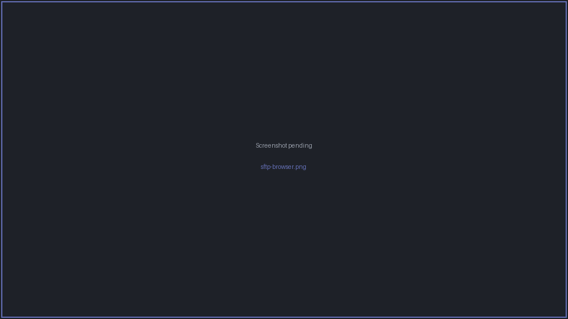

# SFTP file browser

jterm includes an **SFTP file browser** for transferring files to and from a remote host.

## Opening the browser

There are two ways to open it, and they differ in how they authenticate:

- **On a live SSH pane** — focus a connected SSH pane and choose **SSH → Open SFTP Browser**
  (++ctrl+f++). This reuses the **existing connection**, so there's no second authentication.
- **Standalone** — launch SFTP for a saved session from the sidebar's context menu. This opens a
  **fresh connection** to that host (authenticating as usual).

The browser opens in the pane grid (a new column, row, or an empty cell), or in a new tab if the
grid is already full.

## Browsing and transferring

- The directory listing shows the remote filesystem; double-click folders to descend.
- Edit the **path field** directly to jump to a known location.
- **Upload** local files and **download** remote files — multiple files at once are supported.

## Reconnection

If an SFTP browser detects that its connection has dropped, it can **reconnect automatically**.
When it shares a connection with a terminal pane, reconnecting one restores the other too.

See [SSH sessions](ssh-sessions.md) and [SSH auth & vault](ssh-auth-and-vault.md) for connection
and credential details.
