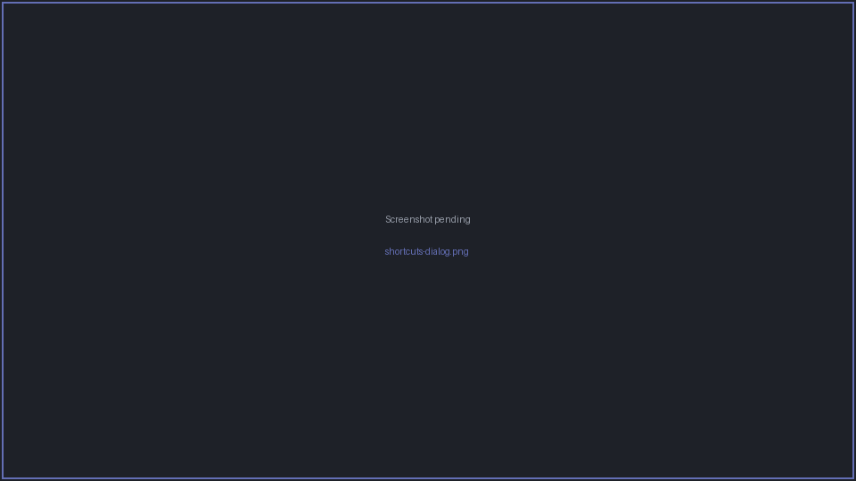

# Keyboard shortcuts

jterm's shortcuts work globally within a window — they fire even when the terminal has keyboard
focus. The menus show the same accelerators for discoverability.

## Defaults

| Action | Shortcut |
|--------|----------|
| New tab | ++ctrl+t++ |
| Close tab | ++ctrl+w++ |
| Duplicate tab | ++ctrl+shift+k++ |
| Move tab left / right | ++ctrl+shift+left++ / ++ctrl+shift+right++ |
| Detach tab to a new window | ++ctrl+shift+o++ |
| Attach tab to the main window | ++ctrl+shift+i++ |
| Open a local shell | ++ctrl+shift+t++ |
| Split into a new column | ++ctrl+right++ |
| Split into a new row | ++ctrl+down++ |
| Close the focused pane | ++ctrl+up++ |
| Duplicate pane to split | ++ctrl+alt+d++ |
| Duplicate pane to tab | ++ctrl+alt+shift+d++ |
| Open SFTP browser | ++ctrl+f++ |
| Tunneling… | ++ctrl+shift+p++ |
| Toggle broadcast input | ++ctrl+shift+b++ |
| Toggle light/dark theme | ++ctrl+shift+l++ |
| Duplicate session | ++ctrl+shift+d++ |
| Move session up / down | ++ctrl+shift+up++ / ++ctrl+shift+down++ |

!!! note "macOS"
    On macOS, ++ctrl++ in the table corresponds to the platform's primary modifier as bound in
    the keymap. Check **Preferences → Keyboard Shortcuts…** for the exact bindings on your
    system.

## Customising shortcuts

Open **Preferences → Keyboard Shortcuts…** to rebind any action.

Bindings are stored in `keymap.json` in the config directory (created with the defaults on first
run). See [Configuration files](config-files.md). You can edit that file directly, but the
in-app editor is the safer route.
