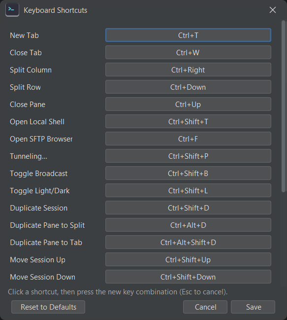

# Keyboard shortcuts

jterm's shortcuts work globally within a window — they fire even when the terminal has keyboard
focus. The menus show the same accelerators for discoverability.

## Defaults

| Action | Shortcut |
|--------|----------|
| New tab | ++ctrl+t++ |
| Close tab | ++ctrl+w++ |
| Duplicate tab | ++ctrl+shift+k++ |
| Move tab left / right | ++ctrl+shift+left++ / ++ctrl+shift+right++ |
| Detach tab to a new window | ++ctrl+shift+o++ |
| Attach tab to the main window | ++ctrl+shift+i++ |
| Open a local shell | ++ctrl+shift+t++ |
| Focus the Quick Connect field | ++ctrl+shift+q++ |
| Split into a new column | ++ctrl+right++ |
| Split into a new row | ++ctrl+down++ |
| Close the focused pane | ++ctrl+up++ |
| Duplicate pane to split | ++ctrl+alt+d++ |
| Duplicate pane to tab | ++ctrl+alt+shift+d++ |
| Rename the connection in the focused pane | ++ctrl+shift+r++ |
| Open SFTP browser | ++ctrl+shift+f++ |
| Tunneling… | ++ctrl+shift+p++ |
| Toggle broadcast input | ++ctrl+shift+b++ |
| Toggle light/dark theme | ++ctrl+shift+l++ |
| Toggle the sessions sidebar | ++ctrl+shift+s++ |
| Duplicate session | ++ctrl+shift+d++ |
| Move session up / down | ++ctrl+shift+up++ / ++ctrl+shift+down++ |
| Increase pane font size | ++ctrl+num-plus++ |
| Decrease pane font size | ++ctrl+num-minus++ |
| Reset pane font size | ++ctrl+num0++ |

!!! note "Font-size keys"
    The increase/decrease/reset bindings shown above are the **numeric keypad** keys (these are
    the editable defaults). The main-row ++ctrl+equal++, ++ctrl+minus++ and ++ctrl+0++ also work
    as built-in aliases, and ++ctrl++ + scroll-wheel zooms the pane under the pointer. See
    [Font size](tabs-and-panes.md#font-size).

!!! note "Open SFTP browser moved from ++ctrl+f++ in 1.9.4"
    It used to be on ++ctrl+f++, which is also the terminal's own **Find** — so on an SSH pane the
    search bar could not be opened. ++ctrl+f++ now searches the pane's text everywhere. If your
    binding was still the old default it is moved to ++ctrl+shift+f++ the first time 1.9.4 starts;
    a binding you had changed yourself is left alone, and so is the old one if you had already
    given ++ctrl+shift+f++ to another action. To get ++ctrl+f++ back, rebind it below — the move
    happens only once.

!!! note "Shortcuts that don't apply fall through"
    A shortcut whose action can't act on the focused pane is passed to the terminal instead of
    being swallowed. **Open SFTP browser** is the one that matters today: it needs a live SSH
    pane, so anywhere else its key is not taken.

!!! note "macOS"
    On macOS, ++ctrl++ in the table corresponds to the platform's primary modifier as bound in
    the keymap. Check **Settings → Keyboard Shortcuts…** for the exact bindings on your
    system.

## Customising shortcuts

Open **Settings → Keyboard Shortcuts…** to rebind any action.

Bindings are stored in `keymap.json` in the config directory (created with the defaults on first
run). Because every default is written there, a default that changes in a later release reaches an
existing install only through a one-time upgrade of that file, tracked by its `schemaVersion`
entry — leave that entry in place when editing by hand. See [Configuration files](config-files.md). You can edit that file directly, but the
in-app editor is the safer route.
