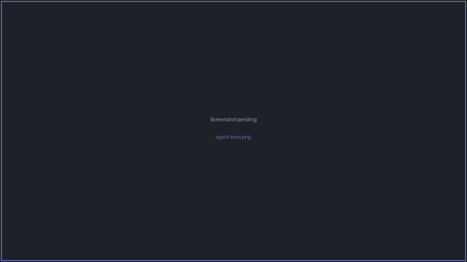
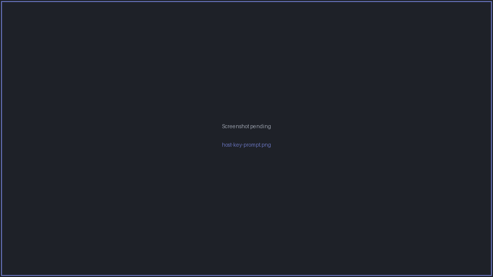

# SSH authentication & the credential vault

## Authentication order

When you open an SSH session, jterm attempts authentication in this order:

1. **Public key**
    - **ssh-agent** identities (with agent forwarding, if enabled), then
    - **on-disk keys** — the *Key file* set on the session, or your `~/.ssh` identities.
2. **Password** — only if you enabled *Password auth* for that session.

You don't choose a method explicitly; jterm offers them in turn and the server picks the first
that succeeds.

### ssh-agent

For agent auth you need a running **ssh-agent** holding your keys (`ssh-add -l` to check).

- On **Linux/macOS** jterm uses the agent socket from `$SSH_AUTH_SOCK`.
- On **Windows** both the native **OpenSSH** agent (named pipe) and **PuTTY Pageant** are
  supported (and used together if both are running).

To see which identities the agent is offering, use **SSH → Show Agent Keys…**.

## The credential vault

Saved SSH **passwords** and **key passphrases** are never written in plaintext. They are stored
**AES-GCM encrypted** in `credentials.json`, protected by a **master password**.

- The first time you save a secret, jterm asks you to **create a master password**.
- On later launches the vault is unlocked — transparently if your OS keyring is available
  (see below), otherwise by **prompting** for the master password once per launch.

### Saving passwords and passphrases

In the session dialog, enable **Password auth** and type a password to have it saved to the
vault. For encrypted keys, jterm can remember the **key passphrase** too. In both cases:

- A **blank** secret field keeps whatever is already saved.
- jterm tries a saved passphrase first and only prompts if it fails.

You can also set **default** passwords/passphrases at the folder or global level — see
[Preferences → Session Defaults](preferences.md).

### OS keyring (remembering the master password)

To avoid typing the master password every launch, jterm stores it in your operating system's
keyring, using native per-OS tooling:

| OS | Keyring backend |
|----|-----------------|
| Linux | Secret Service (GNOME Keyring / KWallet) via the `secret-tool` CLI (`libsecret` / `libsecret-tools`) |
| macOS | login Keychain via the built-in `security` CLI |
| Windows | Windows Credential Manager |

If no keyring is available (common on minimal Linux setups), nothing breaks — you're simply
prompted for the master password at launch instead. See
[Troubleshooting](troubleshooting.md#vault-and-master-password).

## Host-key verification

jterm checks host keys against `~/.ssh/known_hosts` using **trust-on-first-use (TOFU)**:

- The **first** time you connect to a host, you're asked to confirm its key; accepting records
  it in `known_hosts`.
- If a host's key **later changes**, you get a warning (a possible sign of a man-in-the-middle —
  or just a rebuilt server).

To trust first-seen hosts without prompting, enable **Preferences → General → Auto-accept new
host keys**. You're still warned about *changed* keys.
