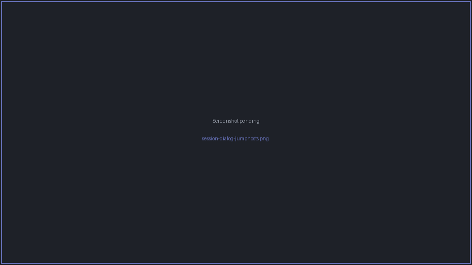

# SSH sessions

A saved **SSH session** stores everything jterm needs to connect to a host. Create one by
right-clicking in the [sessions sidebar](sessions-sidebar.md) and choosing to add a new SSH
session; edit one via its right-click menu.

The session dialog has three tabs.

## Basic settings

| Field | Meaning |
|-------|---------|
| **Name** | Label shown in the sidebar and on the tab. |
| **Host** | Hostname or IP to connect to. |
| **Port** | SSH port (default 22). |
| **User** | Login username. Leave blank to inherit the folder/global default. |
| **Icon** | Pick an icon from the library or import your own. |
| **Keep connection alive** | Send keep-alive traffic so idle connections aren't dropped (see below). |
| **Key file** | Path to a private key. Leave blank to use ssh-agent and your `~/.ssh` identities. |
| **Password auth** | Enable password authentication for this host. |
| **Password** | The password (stored encrypted — see [SSH auth & vault](ssh-auth-and-vault.md)). |
| **Tab color** | A custom colour for this session's tab; *Clear* reverts to the inherited colour. |

Blank fields **inherit** from the containing folder, then the global
[Session Defaults](preferences.md), then jterm's built-in defaults.

## Terminal Settings

Per-session overrides for how the terminal behaves. Any field left blank inherits the
application defaults from **Preferences → Terminal Settings**:

- **Terminal type** (e.g. `xterm-256color`)
- **Character encoding** (default UTF-8)
- **Font family** and **font size**

## Jump Hosts (bastions)

Connect through intermediate **bastion** hosts when the target isn't reachable directly. You can
chain **up to 4** jump hosts; jterm connects through them in order before reaching the final
host. Leave the list empty for a direct connection. Each hop's credentials are resolved at
connect time (prompting or using the vault as needed).

## Keep-alive

Keep-alive stops idle SSH connections from being closed by the server or an intervening
firewall/NAT. It can be configured at three levels, each inheriting from the one above:

1. **Global default** — Preferences → Session Defaults → *Keep connection alive* + interval.
2. **Per-folder** — set on a folder to cover everything beneath it.
3. **Per-session** — the *Keep connection alive* field in the session dialog.

The interval is in seconds (`0` = off).

## Connecting

Double-click the session, or drag it onto a pane. Authentication is attempted automatically —
see [SSH auth & vault](ssh-auth-and-vault.md) for the auth order, the credential vault, and
host-key verification. Once connected you can open an [SFTP browser](sftp.md) or
[tunnels](tunnels.md) on the same host.
