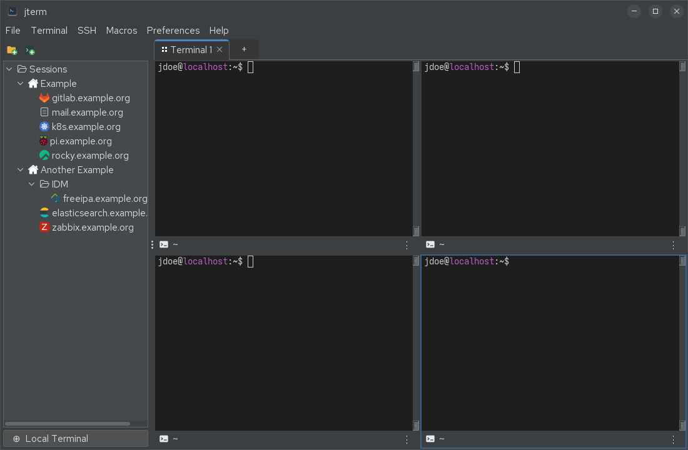
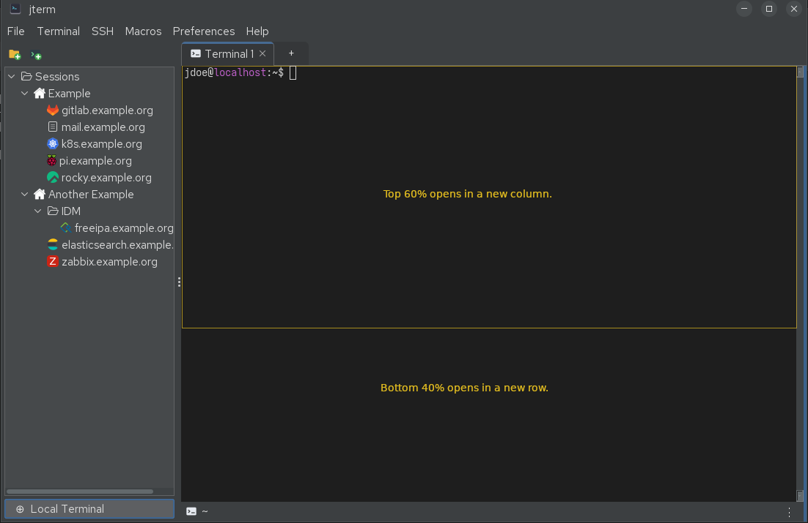

# Tabs & panes

jterm organises terminals into **tabs**, and each tab holds a **grid of panes**.

## Tabs

Each tab contains its own pane grid. Use the **+** button on the tab strip to add a tab, or the
**File** menu / shortcuts below.

| Action | Menu | Shortcut |
|--------|------|----------|
| New tab | File → New Tab | ++ctrl+t++ |
| Close tab | File → Close Tab | ++ctrl+w++ |
| Duplicate tab | File → Duplicate Tab | ++ctrl+shift+k++ |
| Move tab left | File → Move Tab Left | ++ctrl+shift+left++ |
| Move tab right | File → Move Tab Right | ++ctrl+shift+right++ |
| Detach tab to a new window | File → Detach Tab to New Window | ++ctrl+shift+o++ |
| Attach tab back to the main window | (from a detached window) | ++ctrl+shift+i++ |

**Detach** pops the current tab out into its own standalone window — handy for moving a tab to
another monitor. **Attach** sends a detached window's tab back into the main window. You can also
**drag a tab out of the window** to detach it.

## The pane grid

A tab starts as a single pane. You can split it into a **uniform grid of up to 3 columns × 3
rows** (a maximum of 9 panes). All panes in a tab are always **equally sized** — jterm re-lays
the whole grid out evenly on every change, so there are no draggable dividers to fiddle with.

| Action | Menu | Shortcut |
|--------|------|----------|
| Split into a new column | Terminal → Split Column | ++ctrl+right++ |
| Split into a new row | Terminal → Split Row | ++ctrl+down++ |
| Close the focused pane | Terminal → Close Pane | ++ctrl+up++ |
| Duplicate pane into a split | Terminal → Duplicate Pane to Split | ++ctrl+alt+d++ |
| Duplicate pane into a new tab | Terminal → Duplicate Pane to Tab | ++ctrl+alt+shift+d++ |

The **active pane** is highlighted with an accent-coloured border. Click a pane to focus it.

When you **close** a pane its cell becomes empty (and can be re-opened). If closing leaves a
whole trailing row or column empty, the grid **collapses** it so the layout stays rectangular.

!!! tip "Duplicate a session"
    *Duplicate Pane to Split* / *Duplicate Pane to Tab* open another instance of whatever the
    focused pane is running (a fresh local shell, or a new connection to the same SSH session).

## Font size

You can zoom an individual pane's terminal font without affecting any other pane:

| Action | Shortcut |
|--------|----------|
| Increase font size | ++ctrl++ + scroll-wheel up, ++ctrl+num-plus++, or ++ctrl+equal++ |
| Decrease font size | ++ctrl++ + scroll-wheel down, ++ctrl+num-minus++, or ++ctrl+minus++ |
| Reset to the configured size | ++ctrl+num0++ or ++ctrl+0++ |

Ctrl + scroll-wheel zooms the pane **under the pointer**; the keyboard shortcuts zoom the
**focused** pane. The numpad bindings are configurable in **Preferences → Keyboard Shortcuts…**;
the main-row keys and the scroll-wheel gesture are built in.

The adjustment is **per pane and temporary** — it is never written to your saved session or
preferences:

- a **new** pane (a split, a duplicated pane, or a new tab) always opens at its configured font
  size, ignoring any zooming you've done elsewhere;
- if a session **drops and you reconnect** it in the same pane, the pane keeps the size you'd
  zoomed it to.

To change the *default* font size for new panes, use **Preferences** (see
[Preferences](preferences.md)).

## Drag-and-drop to split

You can open a session directly into a split by **dragging** it from the sidebar (or the **Open
Local Terminal** entry) onto an existing pane. Where you drop decides the split:

- drop on the **top ~60%** of the pane → opens a **new column**;
- drop on the **bottom ~40%** of the pane → opens a **new row**.

SSH sessions connect in the background and then appear in the new split; local terminals open
immediately. See [Sessions sidebar](sessions-sidebar.md) for more on launching sessions.

## Rearranging panes and tabs

Every pane has a **title bar** along its bottom edge showing its icon and name. That bar is a
**drag handle**: grab it and drop the live pane somewhere else. The terminal keeps its
scrollback, working directory, and connection — nothing is restarted.

**Drag a pane by its title bar onto…**

- the **+** button on the tab strip → pulls the pane **out into its own new tab**. (If the pane
  is already the only one in its tab, this does nothing.)
- **another pane** in the same tab → the two panes **swap** positions.
- an **empty cell** in the same tab → the pane **moves** into that cell.

A single-pane tab is just a one-pane grid, so you can also rearrange whole tabs:

**Drag a tab by its header onto a pane in *another* tab** (single-pane tabs only) → its terminal
joins that tab as a **split** (top ~60% → new column, bottom ~40% → new row, just like a session
drop), or fills an **empty cell** if you drop it there. The now-empty source tab closes.

When you pull a pane out of a tab whose broadcast is on, the moved pane **leaves that broadcast**
and joins its new tab. Pulling a pane out can leave its old tab's grid smaller — jterm collapses
any empty trailing row or column so the layout stays rectangular.

!!! note
    Dragging a tab still **reorders** it when you drop it back on the tab strip, exactly as
    before. Only single-pane tabs can be dragged into another tab's grid.
