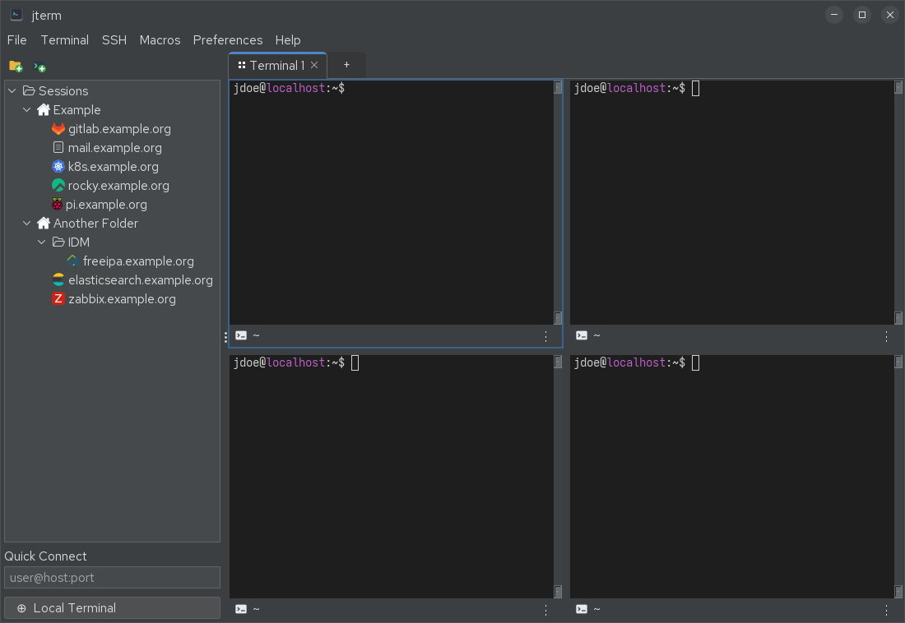
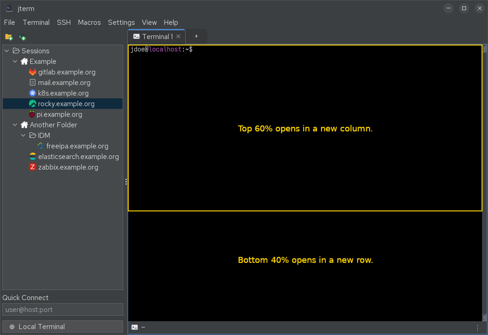

# Tabs & panes

jterm organises terminals into **tabs**, and each tab holds a **grid of panes**.

## Tabs

Each tab contains its own pane grid. Use the **+** button on the tab strip to add a tab, or the
**File** menu / shortcuts below. The sidebar's **Local Terminal** button and **Quick Connect**
field also open into a new tab (see [Sessions sidebar](sessions-sidebar.md#local-terminal)).

| Action | Menu | Shortcut |
|--------|------|----------|
| New tab | File → New Tab | ++ctrl+t++ |
| Close tab | File → Close Tab | ++ctrl+w++ |
| Duplicate tab | File → Duplicate Tab | ++ctrl+shift+k++ |
| Move tab left | File → Move Tab Left | ++ctrl+shift+left++ |
| Move tab right | File → Move Tab Right | ++ctrl+shift+right++ |
| Detach tab to a new window | File → Detach Tab to New Window | ++ctrl+shift+o++ |
| Attach tab back to the main window | (from a detached window) | ++ctrl+shift+i++ |

**Detach** pops the current tab out into its own standalone window — handy for moving a tab to
another monitor. **Attach** sends a detached window's tab back into the main window. You can also
**drag a tab out of the window** to detach it.

## The pane grid

A tab starts as a single pane. You can split it into a **grid of up to 3 columns × 3
rows** (a maximum of 9 panes). New splits always open with an **equal share** of the space;
you can then drag the dividers between panes to change the row and column sizes (see
[Resizing panes](#resizing-panes)).



| Action | Menu | Shortcut |
|--------|------|----------|
| Split into a new column | Terminal → Split Column | ++ctrl+right++ |
| Split into a new row | Terminal → Split Row | ++ctrl+down++ |
| Close the focused pane | Terminal → Close Pane | ++ctrl+up++ |
| Duplicate pane into a split | Terminal → Duplicate Pane to Split | ++ctrl+alt+d++ |
| Duplicate pane into a new tab | Terminal → Duplicate Pane to Tab | ++ctrl+alt+shift+d++ |

The **active pane** is highlighted with an accent-coloured border. Click a pane to focus it.

When you **close** a pane its cell becomes empty (and can be re-opened). If closing leaves a
whole trailing row or column empty, the grid **collapses** it so the layout stays rectangular.

!!! tip "Duplicate a session"
    *Duplicate Pane to Split* / *Duplicate Pane to Tab* open another instance of whatever the
    focused pane is running (a fresh local shell, or a new connection to the same SSH session).

## Resizing panes

The gap between panes is a **draggable divider** — hover over it and the cursor changes and
the divider lights up in the accent colour.

- **Drag** a divider to resize the two neighbouring rows or columns. Sizing is per row and
  per column (never per individual pane), so the grid always stays rectangular.
- **Double-click** a divider to reset its axis — all columns, or all rows — back to equal
  shares.
- A row or column can't be dragged below a **minimum size**, so no pane ever collapses into
  an unusable sliver.

Splitting keeps your proportions: the new row or column takes an equal share and the
existing ones keep their ratio to each other. If closing panes makes the grid **collapse** a
row or column, the sizes on that axis reset to equal shares (the remaining panes may have
moved cells, so the old proportions no longer apply).

## Font size

You can zoom an individual pane's terminal font without affecting any other pane:

| Action | Shortcut |
|--------|----------|
| Increase font size | ++ctrl++ + scroll-wheel up, ++ctrl+num-plus++, or ++ctrl+equal++ |
| Decrease font size | ++ctrl++ + scroll-wheel down, ++ctrl+num-minus++, or ++ctrl+minus++ |
| Reset to the configured size | ++ctrl+num0++ or ++ctrl+0++ |

Ctrl + scroll-wheel zooms the pane **under the pointer**; the keyboard shortcuts zoom the
**focused** pane. The numpad bindings are configurable in **Settings → Keyboard Shortcuts…**;
the main-row keys and the scroll-wheel gesture are built in.

The adjustment is **per pane and temporary** — it is never written to your saved session or
preferences:

- a **new** pane (a split, a duplicated pane, or a new tab) always opens at its configured font
  size, ignoring any zooming you've done elsewhere;
- if a session **drops and you reconnect** it in the same pane, the pane keeps the size you'd
  zoomed it to.

To change the *default* font size for new panes, use **Settings → Preferences…** (see
[Settings](settings.md)).

## Drag-and-drop to split

You can open a session directly into a split by **dragging** it from the sidebar (or the **Local
Terminal** button) onto an existing pane. Where you drop decides the split:

- drop on the **top ~60%** of the pane → opens a **new column**;
- drop on the **bottom ~40%** of the pane → opens a **new row**.



SSH sessions connect in the background and then appear in the new split; local terminals open
immediately. See [Sessions sidebar](sessions-sidebar.md) for more on launching sessions.

## Naming panes and tabs

Every pane has a **title bar** along its bottom edge showing its icon and name. A tab is named
after its **active** pane, so in a split the tab title follows whichever pane you are typing in.

### Renaming a connection

Rename the pane you are in with ++ctrl+shift+r++, from **Terminal → Rename Connection…**, or from
the **⋮** menu on the pane's title bar (right-clicking the bar opens the same menu). Right-clicking
a **tab** offers the same thing — a tab is named after its active pane, so it renames that
connection. The new name replaces the pane's label *and* its tab title. Leave the field blank to go
back to the automatic name.

A rename lives only as long as the pane. It is never written to `sessions.json`, so the saved
session in the sidebar is untouched and other panes on the same host are unaffected. It survives a
reconnect and follows the pane if you drag it to another tab or window, but a **duplicated** pane
starts with its automatic name again.

### Showing the working directory

Turn on **Settings → Preferences → General → Show working directory** to put the shell's current
directory into the labels. The pane's title bar gets the **full path** and the tab gets just the
**last part** of it, so tabs stay short:

| | pane label | tab title |
|---|---|---|
| local shell | `/home/mark/git/jterm` | `Terminal 3 (jterm)` |
| SSH / WSL | `orion.katmoda.lan (/home/mark/git/jterm)` | `orion.katmoda.lan (jterm)` |
| renamed | `build` | `build` |

A **local** shell always shows its directory in the pane label — its own name ("local") says
nothing useful — and the preference only controls whether the directory reaches its tab. A
**renamed** pane shows your name on its own, with no directory: renaming is also how you opt one
pane out.

When the pane is too narrow, leading path components are dropped and replaced with `...` —
`/a/very/long/path/to/some/cwd` becomes `.../to/some/cwd`, then `.../cwd`. Hovering the label
always shows the full path.

!!! warning "SSH and WSL depend on the remote shell"
    jterm cannot read a remote machine's working directory; it can only be *told*. It listens for
    the `OSC 7` sequence and for the window title that most distributions' default bash sets on
    every prompt (`user@host:~/dir`) — which is why this usually works over SSH with no setup at
    all. A shell that emits neither shows no directory, and a full-screen program that takes over
    the window title can leave the last known value on screen until the next prompt. To report it
    explicitly, add this to the remote `~/.bashrc`:

    ```bash
    PROMPT_COMMAND='printf "\033]7;file://%s%s\007" "$HOSTNAME" "$PWD"'
    ```

    Local shells do not need any of this. On Linux jterm reads the directory from the OS; on
    Windows it sets `%PROMPT%` for the `cmd.exe` sessions it starts (only when you have not set
    one yourself) so that cmd reports it; and inside the Flatpak, where the shell runs on the host
    beyond jterm's reach, the host-side PTY agent reports it instead. That agent needs `python3`
    on the host; without it jterm falls back to `script(1)`, which shows no directory (and also
    cannot track the window size).

!!! note "Names from a remote host are treated as untrusted"
    A directory arrives as an escape sequence from whatever you connected to, so jterm strips
    control characters and text-direction overrides (which could otherwise make one host's label
    read like another's) and caps the length before showing it. Hover the label for the full
    value, and rename the pane if you want a name nothing else can influence.

## Rearranging panes and tabs

The pane's title bar is also a **drag handle**: grab it and drop the live pane somewhere else. The terminal keeps its
scrollback, working directory, and connection — nothing is restarted.

**Drag a pane by its title bar onto…**

- the **+** button on the tab strip → pulls the pane **out into its own new tab**. (If the pane
  is already the only one in its tab, this does nothing.)
- **another pane** in the same tab → the two panes **swap** positions.
- an **empty cell** in the same tab → the pane **moves** into that cell.

A single-pane tab is just a one-pane grid, so you can also rearrange whole tabs:

**Drag a tab by its header onto a pane in *another* tab** (single-pane tabs only) → its terminal
joins that tab as a **split** (top ~60% → new column, bottom ~40% → new row, just like a session
drop), or fills an **empty cell** if you drop it there. The now-empty source tab closes.

When you pull a pane out of a tab whose broadcast is on, the moved pane **leaves that broadcast**
and joins its new tab. Pulling a pane out can leave its old tab's grid smaller — jterm collapses
any empty trailing row or column so the layout stays rectangular.

!!! note
    Dragging a tab still **reorders** it when you drop it back on the tab strip, exactly as
    before. Only single-pane tabs can be dragged into another tab's grid.
