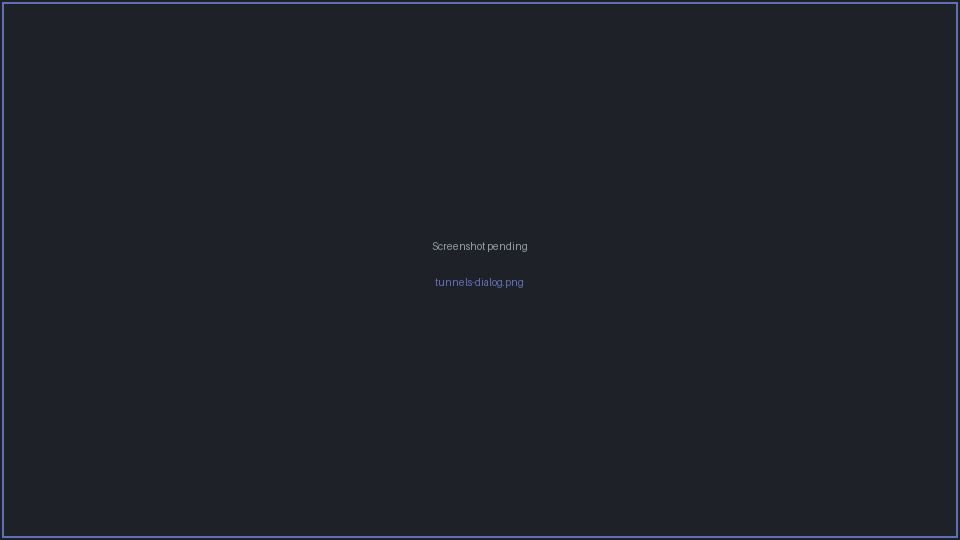
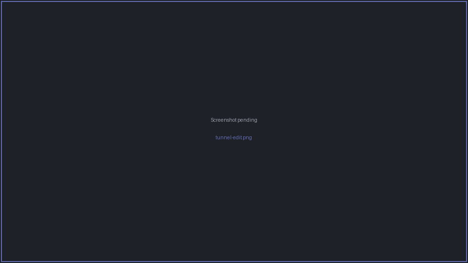

# Port forwarding (tunnels)

jterm can set up SSH **port-forwarding tunnels** — named forwards tied to a saved SSH session.
Open the manager with **SSH → Tunneling…** (++ctrl+shift+p++).

## Tunnel types

| Type | What it does |
|------|--------------|
| **Local** (L) | Forwards a local port to a destination reachable from the SSH server. Connect to `127.0.0.1:<listenPort>` locally and traffic emerges at the destination host/port. |
| **Remote** (R) | Forwards a port on the SSH server back to a destination reachable from your machine. |
| **Dynamic / SOCKS** (D) | Runs a local **SOCKS proxy** on `127.0.0.1:<listenPort>`; point applications at it to route their traffic through the SSH server. |

## Managing tunnels

The manager lists your tunnels with their status. The buttons are:

- **New…** — create a tunnel.
- **Edit…** — change an existing one.
- **Start** / **Stop** — bring a tunnel up or down.
- **Delete** — remove it.
- **Close** — dismiss the dialog (running tunnels keep running).

## Creating a tunnel

In the **New… / Edit…** dialog you set:

- **Name** — a label for the tunnel.
- **Type** — Local, Remote, or Dynamic (SOCKS).
- **SSH session** — the saved session the tunnel runs over.
- **Listen port**, and for Local/Remote the **Destination host** and **Destination port**
  (a SOCKS tunnel needs no destination — clients choose it per connection).
- **Start automatically on launch** — bring this tunnel up whenever jterm starts.

Tunnels are saved in `tunnels.json` (referencing their SSH session) — see
[Configuration files](config-files.md).
